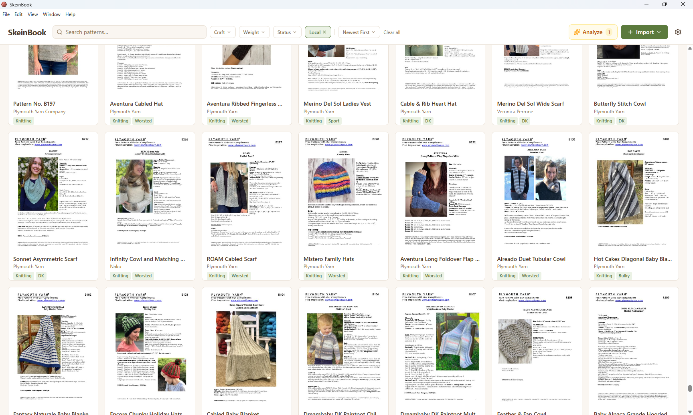

#  SkeinBook

**A desktop pattern library for knitters and crocheters.**

SkeinBook is a native desktop application that helps fiber artists organize, search, and manage their knitting and crochet pattern collections. It runs on macOS and Windows.

---

## What It Does

- **Import PDF patterns**  Drag and drop or browse to add patterns from your computer
- **AI-powered metadata extraction**  Automatically identifies title, designer, yarn weight, gauge, needle sizes, and more from your PDFs
- **Ravelry integration**  Sync your Ravelry library to see all your purchased patterns in one place, with direct links to designer profiles, yarn pages, and pattern pages on Ravelry
- **Full-text search & smart filters**  Find any pattern instantly by title, designer, yarn weight, craft type, or keyword
- **Backup & export**  Export your library as ZIP, CSV, or JSON; restore from backups on any machine
- **Privacy-first**  Your patterns and data stay on your computer. No accounts required, no cloud storage, no tracking

## API Integrations

SkeinBook connects to the following services (only when the user explicitly opts in):

| Service | Purpose | Data Sent |
|---------|---------|-----------|
| **Ravelry** | Sync the user's purchased pattern library | OAuth token (read-only access to the user's own library) |
| **Etsy** | Helps users organize pattern PDFs they've purchased from Etsy. Paste any Etsy listing URL to automatically populate title, designer, and cover image. | OAuth token (read-only access to the user's own purchases and listing data) |
| **Anthropic Claude** | AI extraction of pattern metadata from PDF text | Anonymized text snippets from the user's own PDFs (no filenames, no personal info) |

No user data is ever sold, shared with third parties, or used for advertising.

## Privacy Policy

SkeinBook is a **local-first** application:

- All pattern files and metadata are stored **on the user's own computer** in a local SQLite database
- API connections (Ravelry, Etsy) use **OAuth 2.0** with minimal read-only scopes
- Users can disconnect any service at any time and delete all synced data
- No analytics, telemetry, or advertising SDKs are included
- Crash reporting (via Sentry) is opt-in and scrubs all personally identifiable information before transmission
- An optional shared metadata cache stores only **AI-extracted metadata from non-Ravelry pattern files** (title, designer, yarn weight). Ravelry data is never stored server-side — never file contents, usernames, or personal data

## Technology

- Built with [Electron](https://www.electronjs.org/) + [React](https://react.dev/) + [TypeScript](https://www.typescriptlang.org/)
- Local database: [SQLite](https://sqlite.org/) via [Drizzle ORM](https://orm.drizzle.team/)
- PDF rendering: [PDF.js](https://mozilla.github.io/pdf.js/)
- OCR: [Tesseract.js](https://tesseract.projectnaptha.com/)

## Roadmap

- **Etsy purchase history import** — Automatically sync patterns purchased on Etsy
- **Expanded craft support** — Sewing, quilting, embroidery, and other fiber arts pattern management
- **Pattern notes & project tracking** — Attach personal notes, modifications, and gauge records to any pattern

## Status

SkeinBook is in **closed beta** as of March 2026. Public release coming soon.

## Contact

- **Developer:** Timothy Askew
- **GitHub:** [github.com/timothyaskew](https://github.com/timothyaskew)
- **Repository:** Private (source code available on request for API verification)

---

*SkeinBook is not affiliated with Ravelry, Etsy, or any pattern publisher.*
